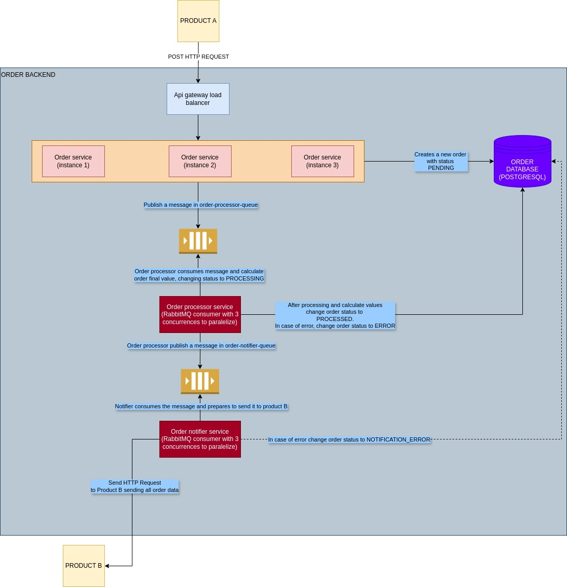

# ORDER SERVICE BACKEND

Project developed for order management, using a distributed architecture based on microservices.

## Project Structure

The project is divided into the following modules:

- **order-api-gateway**: Responsible for routing requests between microservices.
- **order-model**: Defines data models shared among microservices.
- **order-notifier**: Handles sending notifications related to orders for product B.
- **order-processor**: Processes purchase orders calculating values and manages their lifecycle.
- **order-service**: Manages the main operations of the order system and provides services for consulting orders and products by customer.
- **order-service-discovery**: Implements service registration and discovery.

## Architecture of the order creation process

## Local Database Configuration

| Property               | Value                    |
|------------------------|--------------------------|
| Address                | <http://localhost:5432>  |
| User                   | order                    |
| Password               | orderservice             |
| Database               | order                    |
| Schema                 | order                    |

## Prerequisites to Run the Application

1. [Docker and Docker Compose](https://docs.docker.com/get-docker/)
2. Java 21
3. Maven

## Step-by-Step Backend Installation

1. Run the command `docker-compose up -d` in the project **order-service** to create database.
2. Run the command `docker-compose up -d` in the project **order-processor** to create RabbitMQ queues and exchanges.
3. Compile the project with `mvn clean install` in this following order: **order-model**, **order-api-gateway**, **order-notifier**, **order-processor**, **order-service**, **order-service-discovery**
4. To start the application, run `mvn spring-boot:run` inside each microservice. The order of the microservices should be **order-service-discovery**, **order-service**, **order-notifier**, **order-processor**, **order-api-gateway**
5. The application will be up and running.

## Code Coverage for Version 1.0 (12/02/2025) of order-service

### |███████████████░░░░░░░| 88%

## List of Version 1.0 Endpoints

### order-service

| HTTP Verb  | Context                   | Description                         |
|------------|---------------------------|-------------------------------------|
| POST       | /orders/order                     | Create a new order                 |
| GET        | /orders/order/{id}                | Retrieve order details             |
| GET        | /orders/order/                | Retrieve all orders by customer           |
| GET     | /orders/product                | Retrieve all products of system                    |

## Postman Collection

- [Collection](./ORDER%20SERVICE.postman_collection.json)
- [Environment Variables](ORDER%20SERVICE.postman_environment.json)

## Contact

For any questions or support, please contact us via email: `juniorjrcsccp@gmail.com`.
